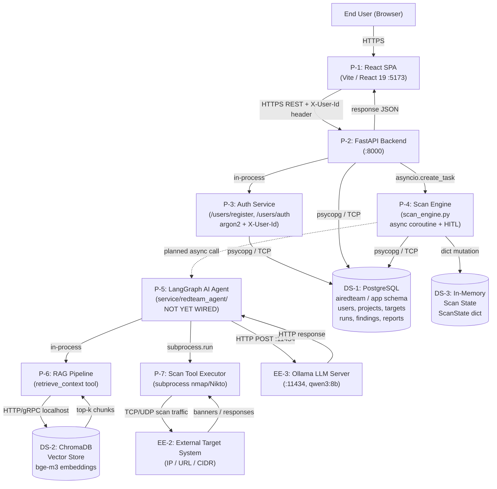

# AI RedTeam — Project Context

**Last Updated:** 2025/03/06

---

## Project Overview

AI RedTeam is an AI-driven red-team simulation platform for security analysts, developers, and small teams who want to assess the security of their systems without deep penetration-testing expertise. Users define an authorized target scope (URLs, IP ranges, CIDR blocks), initiate guided security assessments, review real-time findings through a live terminal dashboard, approve or deny high-impact actions via a human-in-the-loop gate, and export structured vulnerability reports (JSON; PDF planned).

The core value proposition is making professional-grade penetration testing affordable and repeatable without cloud dependencies. All LLM inference and scan data processing runs locally — no data leaves the machine (NFR-5). The system uses a locally hosted LLM (Ollama / `qwen3:8b`) enhanced with a RAG pipeline to generate context-aware attack plans, and wraps open-source scanning tools (nmap, Nikto) with an AI reasoning layer and mandatory human oversight gates.

**Primary users:** Security-focused developers, student engineers, and small teams.
**Academic context:** Purdue ECE 49595 Senior Design — Team S06, Fall 2025 / Spring 2026.

---

## Tech Stack

| Layer | Technology |
|-------|-----------|
| Backend API | Python, FastAPI 0.133, Uvicorn 0.40 |
| ORM / Migrations | SQLAlchemy 2.0, Alembic 1.18, psycopg 3.3 |
| Password Hashing | argon2-cffi 25.1 |
| Database | PostgreSQL (`airedteam` DB, `app` schema), 3-role model: owner / runtime / migrate |
| Frontend | React 19, Vite 7, TailwindCSS 4 |
| AI Agent | LangGraph, Ollama (`qwen3:8b`), ChromaDB 1.4, `bge-m3` embeddings |
| Scanning Tools | nmap (subprocess); Nikto, SQLMap planned in Docker sandboxes |
| Config | pydantic-settings, python-dotenv |
| Infra | Manual setup via `scripts/database_setup/`; Docker Compose planned (NFR-4) |

---

## Architecture Summary

### Trust Boundaries

| ID | Boundary | Description |
|----|----------|-------------|
| TB-1 | User Device ↔ App Server | Internet-facing; HTTP in dev, HTTPS required in production |
| TB-2 | App Process ↔ PostgreSQL | DB boundary; runtime role has DML-only privileges, no DDL |
| TB-3 | App Process ↔ Ollama | Localhost process boundary; no auth, no TLS |
| TB-4 | Agent/Executor ↔ External Target | **Critical** — where active scan traffic exits to the target network |
| TB-5 | App Process ↔ ChromaDB | Localhost service boundary; no auth |

---

## Feature Status Table

| Feature | Status | Notes |
|---------|--------|-------|
| Auth / Session Management | 🟡 | argon2 hash + raw UUID in `X-User-Id` header; no token security; Clerk pending |
| User Registration / Login | ✅ | `POST /users/register` + `/users/auth`; 409-fallback flow in `EmailEntry.jsx` |
| Projects CRUD | ✅ | Ownership-gated create / list / delete via `ProjectsBroker` |
| Targets CRUD | ✅ | Auto-type inference (IP / CIDR / DOMAIN / URL), per-project |
| Scan Engine scaffold | 🟡 | HITL event loop + DB persistence complete; AI agent call is **simulated** |
| LangGraph AI Agent | 🟡 | `service/redteam_agent/` standalone; **not wired to FastAPI backend** |
| RAG Pipeline (ChromaDB) | 🟡 | Implemented in `service/`; not connected to FastAPI |
| Dashboard (live terminal) | ✅ | Polls `/scans/{id}/status` every 1 s; shows HITL modal; kill switch |
| HITL Approve / Deny Gate | ✅ | Frontend modal + backend endpoints fire `asyncio.Event` |
| Findings + Reports (DB + UI) | ✅ | Full DB models, routes, `ReportView.jsx` with A–F severity grade |
| Report Export — JSON | ✅ | Blob download in `ReportView.jsx` |
| Report Export — PDF | 🔴 | `ReportFormat.PDF` enum value defined; not implemented |
| Authorization Verification (FR-6) | 🟡 | Frontend "I AUTHORIZE" text gate only; no backend ownership token check |
| Sandboxed Execution (FR-7) | 🔴 | nmap runs as host subprocess; Docker isolation not started |
| Audit Log (NFR-2) | 🔴 | No append-only log; HITL approvals/denials not persisted separately |
| Docker / Containerization | 🔴 | No Dockerfiles; Docker Compose planned per NFR-4 |
| Payment / Credit System | 🔴 | Planned; no architecture defined yet |
| Clerk Auth Integration | 🔴 | Planned production replacement for custom `X-User-Id` auth |

**Status key:** ✅ Implemented & working | 🟡 In progress / partial | 🔴 Not started / planned

---

## Current Auth State

**What is active now:**
- `POST /users/register` creates a user; password hashed with argon2.
- `POST /users/auth` verifies credentials and returns `{ user_id: <UUID> }`.
- The frontend (`EmailEntry.jsx`) stores the UUID in a module-level JS variable (`_userId` in `api.js`) via `setAuthUserId()`.
- Every subsequent API call injects `X-User-Id: <UUID>` as a plain request header.
- `deps.py` extracts and validates the UUID on protected routes via `Depends(get_current_user_id)`.

**What is missing / insecure:**
- There are no session tokens, JWTs, or cookies — any client that knows a valid UUID can impersonate that user with no expiry or revocation mechanism.
- There is no auth middleware applied globally; each route must explicitly declare the dependency.
- There is a `TODO` comment in `users.py` acknowledging this must be replaced with a proper session-token system before production.

**Planned:**
- **Clerk** will replace the custom system as the production auth provider. No integration code exists yet.

---

## Planned Components

| Component | Priority | Notes |
|-----------|----------|-------|
| Clerk Auth Integration | High | Replace `X-User-Id` with Clerk JWTs; middleware-level enforcement |
| Docker Compose stack | High | Containerize FastAPI, PostgreSQL, Ollama, ChromaDB, scan sandbox (NFR-4) |
| Sandboxed scan execution | High | Run nmap/Nikto/SQLMap in ephemeral Docker containers with constrained networks (FR-7) |
| Backend authorization verification | High | Enforce target ownership proof server-side (FR-6); currently frontend-only |
| Audit log | High | Append-only HITL approval/denial trail, 90-day retention, tamper-proof (NFR-2) |
| AI Agent ↔ Backend integration | High | Wire `service/redteam_agent/agent.py` into `scan_engine.py` at the documented drop-in point (~line 147) |
| PDF report export | Medium | Server-side or client-side generation; `ReportFormat.PDF` enum already defined |
| Payment / credit system | Medium | Token-based usage gating; architecture TBD |
| Rate limiting / passive mode defaults | Medium | FastAPI middleware; SDP specifies passive-mode default (FR-1) |
| Adaptive RAG updates | Low | Automated scraping of OWASP and security feeds into ChromaDB |
| Secrets management | High | Move DB credentials and API keys out of `.env` into a secrets provider for production |

---

## Known Risks / Open Questions

1. **Auth is trivially bypassable** — The `X-User-Id` header provides zero cryptographic security. Any client that discovers or guesses a valid UUID has full account access with no token expiry, session revocation, or rate-limited login attempts. This is the highest-priority pre-production security risk.

2. **AI agent not connected to backend** — `scan_engine.py`'s `run_agent` coroutine is a simulated sleep loop. The real LangGraph agent exists in `service/redteam_agent/` but has no integration point with FastAPI. The drop-in location is documented with a comment in `scan_engine.py` around line 147.

3. **No sandboxed execution** — `execute_nmap_scan` in `service/redteam_agent/tools.py` runs nmap as a host OS subprocess with no network isolation. FR-7 requires Docker-isolated execution; this is not implemented.

4. **No audit log** — HITL approvals and denials are not persisted anywhere. The `Runs` table has no approval history column. NFR-2 requires 90-day retention and tamper-proof logs.

5. **CORS locked to `localhost:5173`** — `backend.py` hardcodes the Vite dev-server origin. Any production or staging deployment will require CORS reconfiguration.

6. **No rate limiting or passive-mode default** — The SDP (FR-1) specifies the system must default to passive (non-intrusive) mode and enforce scan rate limits to prevent accidental DoS. Neither is implemented in FastAPI.

7. **Plaintext credentials in `.env`** — Root `.env` contains DB passwords in plaintext (e.g., `DB_OWNER_PASSWORD`, `DB_RUNTIME_PASSWORD`). These must be moved to a secrets manager before any cloud deployment.

8. **Ollama and ChromaDB have no authentication** — Both services are accessed over localhost with no API keys or TLS. In a multi-tenant or networked deployment, these would be exposed without any access control.

---

## DFD Element Reference (OWASP)

Quick lookup for threat modeling. Full connection catalog is in the threat model document.

| ID | Shape | Name | Trust Boundary |
|----|-------|------|---------------|
| EE-1 | Rectangle | End User | TB-1 (external) |
| EE-2 | Rectangle | External Target System | TB-4 (external) |
| EE-3 | Rectangle | Ollama LLM Server | TB-3 (localhost) |
| P-1 | Circle | React SPA | TB-1 |
| P-2 | Circle | FastAPI Backend | TB-1, TB-2, TB-3 |
| P-3 | Circle | Auth Service | TB-2 |
| P-4 | Circle | Scan Engine | TB-2 |
| P-5 | Circle | LangGraph AI Agent | TB-3, TB-4 |
| P-6 | Circle | RAG Pipeline | TB-5 |
| P-7 | Circle | Scan Tool Executor | TB-4 |
| DS-1 | Parallel lines | PostgreSQL DB | TB-2 |
| DS-2 | Parallel lines | ChromaDB Vector Store | TB-5 |
| DS-3 | Parallel lines | In-Memory Scan State | None (in-process) |
