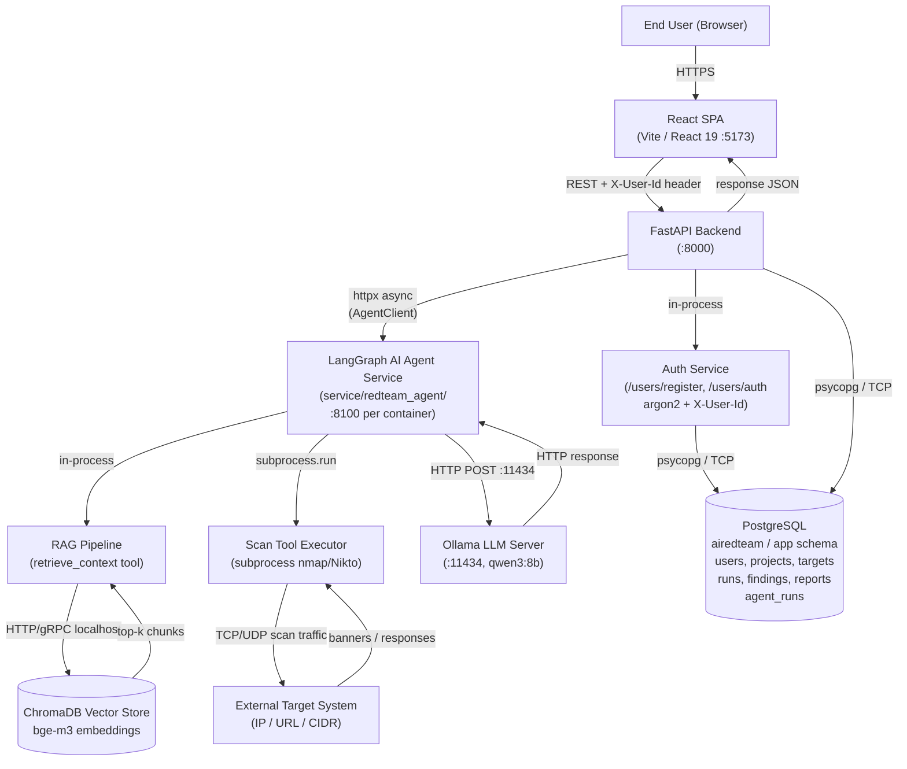

# AI RedTeam — Project Context

**Last Updated:** 2026/04/05

---

## Project Overview

AI RedTeam is an AI-driven red-team simulation platform for security analysts, developers, and small teams who want to assess the security of their systems without deep penetration-testing expertise. Users define an authorized target scope (URLs, IP ranges, CIDR blocks), initiate guided security assessments, review real-time findings through a live terminal dashboard, approve or deny high-impact actions via a human-in-the-loop gate, and receive auto-generated vulnerability reports (JSON; PDF planned).

The core value proposition is making professional-grade penetration testing affordable and repeatable without cloud dependencies. All LLM inference and scan data processing runs locally — no data leaves the machine (NFR-5). The system uses a locally hosted LLM (Ollama / `qwen3:8b`) enhanced with a RAG pipeline to generate context-aware attack plans, and wraps open-source scanning tools (nmap, Nikto) with an AI reasoning layer and mandatory human oversight gates.

**Primary users:** Security-focused developers, student engineers, and small teams.
**Academic context:** Purdue ECE 49595 Senior Design — Team S06, Fall 2025 / Spring 2026.

---

## Tech Stack

| Layer | Technology |
|-------|-----------|
| Backend API | Python, FastAPI 0.133, Uvicorn 0.40 |
| ORM / Migrations | SQLAlchemy 2.0, Alembic 1.18, psycopg 3.3 |
| Password Hashing | argon2-cffi 25.1 |
| Database | PostgreSQL (`airedteam` DB, `app` schema), 3-role model: owner / runtime / migrate |
| Frontend | React 19, Vite 7, TailwindCSS 4 |
| AI Agent | LangGraph, Ollama (`qwen3:8b`), ChromaDB 1.4, `bge-m3` embeddings |
| Agent ↔ Backend | httpx async client (`AgentClient`), per-project container routing |
| Scanning Tools | nmap (subprocess); Nikto, SQLMap planned in Docker sandboxes |
| Config | pydantic-settings, python-dotenv |
| Infra | Manual setup via `scripts/database_setup/`; Docker Compose planned (NFR-4) |

---

## Architecture Summary

The system is split into three deployable units: the **React SPA** (frontend), the **FastAPI Backend** (API + DB layer), and the **Agent Service** (LangGraph AI agent, one container per project). The backend acts as a thin authenticated proxy between the frontend and the agent service.

### Agent Proxy Pattern

The backend does **not** run the AI agent itself. Instead, it proxies requests to a standalone Agent Service container via `AgentClient` (httpx). In development, all requests go to a single agent at `AGENT_SERVICE_URL` (e.g., `http://localhost:8100`). In production, each project routes to its own container via `http://agent-{project_id}:8100`.

The `/agent/*` backend routes authenticate the user, resolve the project's agent container URL, and forward the request. Run-to-project mapping is persisted in the `agent_runs` database table (replacing an earlier in-memory dictionary).

---

## Feature Status Table

| Feature | Status | Notes |
|---------|--------|-------|
| Auth / Session Management | 🟡 | argon2 hash + raw UUID in `X-User-Id` header; no token security; Clerk pending |
| User Registration / Login | ✅ | `POST /users/register` + `/users/auth`; 409-fallback flow in `AuthLanding.jsx` |
| Projects CRUD | ✅ | Ownership-gated create / list / delete via `ProjectsBroker` |
| Targets CRUD | ✅ | Auto-type inference (IP / CIDR / DOMAIN / URL), per-project |
| LangGraph AI Agent | ✅ | `service/redteam_agent/` — standalone FastAPI microservice with LangGraph stream loop |
| Agent ↔ Backend integration | ✅ | `/agent/*` routes proxy to Agent Service via `AgentClient` (httpx); `agent_runs` DB table tracks run-to-project mapping |
| RAG Pipeline (ChromaDB) | ✅ | `retrieve_context` tool inside agent; queries ChromaDB with `bge-m3` embeddings |
| Dashboard (live terminal) | ✅ | Polls `GET /agent/{run_id}/status` every 1 s; shows HITL modal; kill switch |
| HITL Approve / Deny Gate | ✅ | Frontend modal + backend proxy endpoints; agent blocks on `threading.Event` |
| Report auto-persistence | ✅ | On run completion, backend auto-creates a `Reports` row with findings as JSON in `content`; `agent_runs.report_id` tracks idempotency with `SELECT ... FOR UPDATE` row lock |
| Report View (frontend) | ✅ | `ReportView.jsx` — A–F severity scorecard, findings by severity, JSON download; auto-redirect from Dashboard on completion |
| Report Export — JSON | ✅ | Blob download in `ReportView.jsx` |
| Report Export — PDF | 🔴 | `ReportFormat.PDF` enum value defined; not implemented |
| Authorization Verification (FR-6) | 🟡 | Frontend "I AUTHORIZE" text gate only; no backend ownership token check |
| Sandboxed Execution (FR-7) | 🔴 | nmap runs as host subprocess; Docker isolation not started |
| Audit Log (NFR-2) | 🔴 | No append-only log; HITL approvals/denials not persisted separately |
| Docker / Containerization | 🔴 | No Dockerfiles; Docker Compose planned per NFR-4 |
| Payment / Credit System | 🔴 | Planned; no architecture defined yet |
| Clerk Auth Integration | 🔴 | Planned production replacement for custom `X-User-Id` auth |
| Legacy scan engine (`/scans/*`) | ⚪ | Deprecated — simulated scan loop in `scan_engine.py`; still routed but superseded by `/agent/*` |

**Status key:** ✅ Implemented & working | 🟡 In progress / partial | 🔴 Not started / planned | ⚪ Deprecated

---

## Database Schema

All tables live in the `app` schema. Migration chain: `cab05be302d4` → `3e1fdafd6344` → `4b82ca5b10a3` → `62bb4a93e5b9`.

| Table | Key Columns | Notes |
|-------|-------------|-------|
| `users` | `id` (UUID PK), `email`, `hashed_password`, `is_verified`, `created_at` | argon2 hashed passwords |
| `projects` | `id` (UUID PK), `name`, `description`, `project_status`, `owner_id` → `users` | Cascade delete from owner |
| `targets` | `id` (UUID PK), `target_type` (enum), `label`, `value`, `project_id` → `projects` | IP / CIDR / DOMAIN / URL |
| `runs` | `id` (UUID PK), `run_type`, `purpose`, `status`, `tool_name`, `raw_command`, `project_id` → `projects`, `target_id` → `targets` | Used by legacy scan engine |
| `findings` | `id` (UUID PK), `finding_type`, `severity`, `title`, `content`, `evidence`, `confidence`, `run_id` → `runs` | Used by legacy scan engine |
| `reports` | `id` (UUID PK), `title`, `summary`, `content` (Text), `report_format` (enum), `project_id` → `projects` | Agent reports store findings as JSON in `content` |
| `agent_runs` | `run_id` (String(32) PK), `project_id` → `projects`, `created_at`, `report_id` → `reports` | Maps agent run hex IDs to projects; `report_id` is the idempotency marker for auto-persistence |

---

## Backend API Endpoints

### Agent routes (`/agent/*`) — primary product flow

| Method | Path | Purpose |
|--------|------|---------|
| POST | `/agent/start` | Start agent run; proxies to Agent Service, writes `agent_runs` row |
| GET | `/agent/{run_id}/status` | Poll status; auto-persists report on completion; returns `report_id` |
| POST | `/agent/{run_id}/approve` | Approve pending HITL action |
| POST | `/agent/{run_id}/deny` | Deny pending HITL action |
| POST | `/agent/{run_id}/kill` | Emergency stop |

### Auth & resource routes

| Method | Path | Purpose |
|--------|------|---------|
| POST | `/users/register` | Create user (argon2 hash) |
| POST | `/users/auth` | Verify credentials, return `user_id` |
| GET | `/users/me` | Current user profile |
| GET | `/projects` | List projects for current user |
| POST | `/projects` | Create project |
| DELETE | `/projects/{project_id}` | Delete project (cascade) |
| GET | `/projects/{project_id}` | Get single project |
| GET | `/projects/{project_id}/findings` | List findings for project |
| GET | `/projects/{project_id}/reports` | List reports for project |
| GET/POST/PATCH/DELETE | `/projects/{project_id}/targets/*` | Targets CRUD |
| GET | `/reports/{report_id}` | Fetch persisted report by UUID |

### Legacy scan routes (`/scans/*`) — deprecated

| Method | Path | Purpose |
|--------|------|---------|
| POST | `/scans/start` | Start simulated scan |
| GET | `/scans/{run_id}/status` | Poll simulated scan status |
| GET | `/scans/{run_id}/findings` | Fetch findings for completed scan |
| POST | `/scans/{run_id}/approve` | Approve simulated HITL |
| POST | `/scans/{run_id}/deny` | Deny simulated HITL |
| POST | `/scans/{run_id}/kill` | Kill simulated scan |

---

## Current Auth State

**What is active now:**
- `POST /users/register` creates a user; password hashed with argon2.
- `POST /users/auth` verifies credentials and returns `{ user_id: <UUID> }`.
- The frontend stores the UUID in a module-level JS variable (`_userId` in `api.js`) via `setAuthUserId()`.
- Every subsequent API call injects `X-User-Id: <UUID>` as a plain request header.
- `deps.py` extracts and validates the UUID on protected routes via `Depends(get_current_user_id)`.

**What is missing / insecure:**
- There are no session tokens, JWTs, or cookies — any client that knows a valid UUID can impersonate that user with no expiry or revocation mechanism.
- There is no auth middleware applied globally; each route must explicitly declare the dependency.
- There is a `TODO` comment in `users.py` acknowledging this must be replaced with a proper session-token system before production.

**Planned:**
- **Clerk** will replace the custom system as the production auth provider. No integration code exists yet.

---

## Planned Components

| Component | Priority | Notes |
|-----------|----------|-------|
| Clerk Auth Integration | High | Replace `X-User-Id` with Clerk JWTs; middleware-level enforcement |
| Docker Compose stack | High | Containerize FastAPI, PostgreSQL, Ollama, ChromaDB, agent per-project containers (NFR-4) |
| Sandboxed scan execution | High | Run nmap/Nikto/SQLMap in ephemeral Docker containers with constrained networks (FR-7) |
| Backend authorization verification | High | Enforce target ownership proof server-side (FR-6); currently frontend-only |
| Audit log | High | Append-only HITL approval/denial trail, 90-day retention, tamper-proof (NFR-2) |
| PDF report export | Medium | Server-side or client-side generation; `ReportFormat.PDF` enum already defined |
| Payment / credit system | Medium | Token-based usage gating; architecture TBD |
| Rate limiting / passive mode defaults | Medium | FastAPI middleware; SDP specifies passive-mode default (FR-1) |
| Legacy scan engine cleanup | Low | Remove `/scans/*` routes and `scan_engine.py` once agent flow is fully validated |
| Adaptive RAG updates | Low | Automated scraping of OWASP and security feeds into ChromaDB |
| Secrets management | High | Move DB credentials and API keys out of `.env` into a secrets provider for production |

---

## Known Risks / Open Questions

1. **Auth is trivially bypassable** — The `X-User-Id` header provides zero cryptographic security. Any client that discovers or guesses a valid UUID has full account access with no token expiry, session revocation, or rate-limited login attempts. This is the highest-priority pre-production security risk.

2. **No sandboxed execution** — `execute_nmap_scan` in `service/redteam_agent/tools.py` runs nmap as a host OS subprocess with no network isolation. FR-7 requires Docker-isolated execution; this is not implemented.

3. **No audit log** — HITL approvals and denials are not persisted anywhere. The `agent_runs` table tracks run metadata but not individual HITL decisions. NFR-2 requires 90-day retention and tamper-proof logs.

4. **CORS locked to `localhost:5173`** — `backend.py` hardcodes the Vite dev-server origin. Any production or staging deployment will require CORS reconfiguration.

5. **No rate limiting or passive-mode default** — The SDP (FR-1) specifies the system must default to passive (non-intrusive) mode and enforce scan rate limits to prevent accidental DoS. Neither is implemented in FastAPI.

6. **Plaintext credentials in `.env`** — Root `.env` contains DB passwords in plaintext (e.g., `DB_OWNER_PASSWORD`, `DB_RUNTIME_PASSWORD`). These must be moved to a secrets manager before any cloud deployment.

7. **Ollama and ChromaDB have no authentication** — Both services are accessed over localhost with no API keys or TLS. In a multi-tenant or networked deployment, these would be exposed without any access control.

8. **Dead frontend components** — `ScopeConfig.jsx` and `ProjectScopeManager.jsx` exist in `frontend/src/pages/` but are not wired into `App.jsx` routing. These should be removed or integrated.
